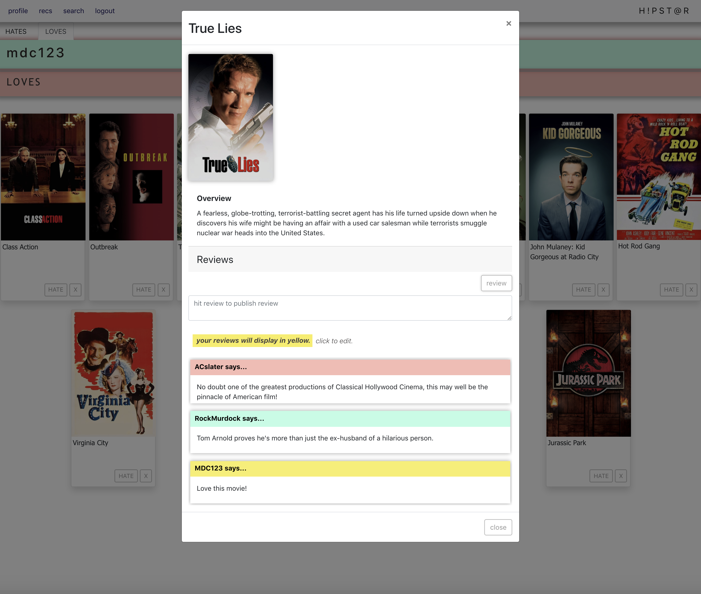
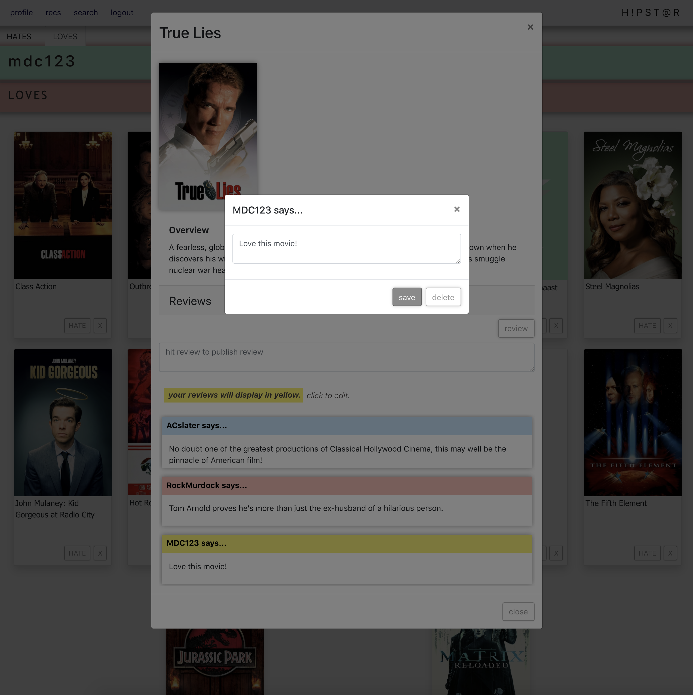
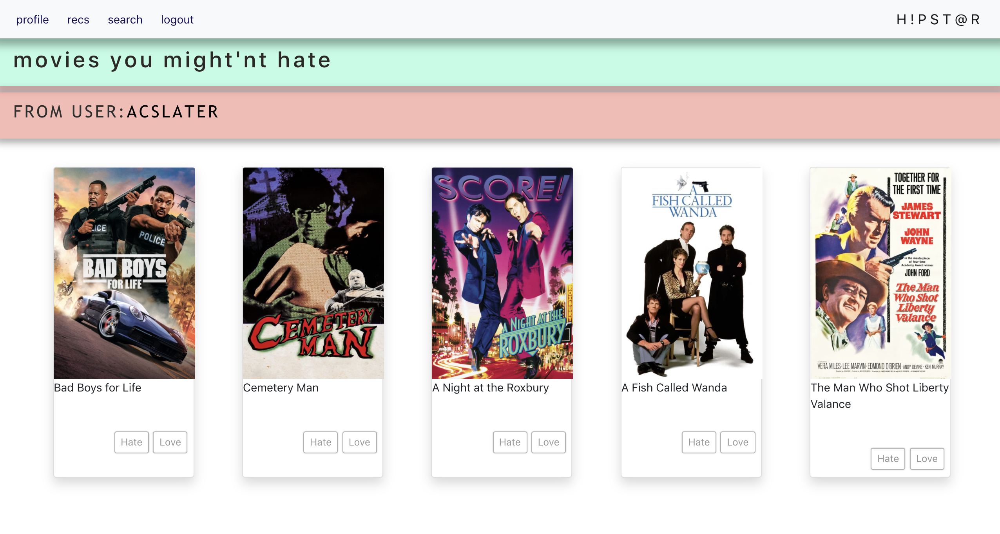

# h!pstar
h!pstar is a movie rating and recommendation app which connects users and recommends movies by a metric of mutual distaste.

## Table of Contents
  * [Search Database](#search-the-movie-database)
  * [User Profile](#user-profile)
  * [Recommendation Page](#recommendation-page)
  * [Future Plans](#future-plans)
  * [Technology Used](#technology-used)
  * [Install Instructions](#install-instructions)
  * [Appreciations](#appreciations)

## The User Experience

### Search The Movie Database

With help from an external API (The Movie Database), a user can search for a movie and see the results of their search. From the search results page, a user can rate the movie as "Loved" or "Hated," and can remove existing ratings from films.  


Clicking on a search results card will open a modal which gives the user more detailed description of the film.


### User Profile

After a user has rated movies, the Loved and Hated movies will show up under the "Loves" and "Hates" tabs on the user's profile page. From here users can re-rate movies or remove a rating. When these affordances are utilized, the movie will be moved to the corresponding tab on the profile or removed from the profile entirely.


From the Profile Page, when a user clicks on a movie card, they are presented with a modal displaying a description of the film, reviews of the movie made by users of the site, and an affordance for the active user to add their own review.

When a user clicks on one of their own reviews they are provided an affordance to edit or delete the review is displayed. When the user clicks on another reviewer's username they are directed to that user's profile page.




### Recommendation Page

After a user has rated a movie as "Hated," they are delivered a list of recommended movies on the Recs page. The active user's list of hated movies is compared to all other user's hated movies list and is matched with the user whose Hated Movie List has the most in common. The active user is presented with movies from the matched user's Loved Movie List which the active user has not yet rated.



### Future Plans

This was a front-end project at Nashville Software School, made before I had a conception of what back-end meant. I soon came to realize that my ultimate conception of a movie recommendation project was that of a back-end project. A future iteration of this app will be build with Django ORM with Rest Framework. Recommendations will be based on more advanced data relationships.


## Technologies Used
    React.js
    Reactstrap
    The Movie Database (external API)
    HTML
    CSS


## Install Instructions

### Clone the Project
Enter the following command in your terminal to clone the project to your computer.
```sh
    git clone git@github.com:mister-michael/hipStar.git
```
### The Movie Database API

To use the site you will need access to [The Movie Database API](https://www.themoviedb.org/documentation/api). Sign up for an account and request a API key in your Profile and Settings by clicking on the Avatar on the top right of the screen.

When you receive your key you will need to add it to the project. Create a file called "apiKey.js" in the "src" folder. 

```sh
    cd hipstar/src
    touch apiKey.js
    ls
    cd ..
```

Open the "apiKey.js" file and declare the value of the apiKey variable as your key as shown below. You can copy the template code below.

    const apiKey = "paste your key inside the quotation marks"
    
    export default apiKey


### NPM Install
Install the NPM dependencies from the root directory (hipstar)
```sh
    npm install
    npm install react-router-dom
    npm install reactstrap react react-dom
```

### Json Server
Move to the api directory
```sh
    cd api
    touch database.json
    ls
```

Copy the contents of the database.json.example file into your newly created database.json file.

Then run your JSON server.
```sh
    json-server -p 5002 -w database.json
```

### NPM Start

After installing dependencies, adding your TMDb key and creating your databse.json file, start the server
```sh
    npm start
```

Now that the server is running, you can visit the site
```sh
    http://localhost:3000/
```


## Appreciations

Thank you for taking the time to view my work. This was my first big project after three months of coding, and I had so much fun making it. I couldn't have done it without the guidance of my instructors [Andy Collins](https://github.com/askingalot), [Kristen Norris](https://github.com/krnorris65) and [Bryan Nilsen](https://github.com/BryanNilsen) at the Nashville Software School.

If you enjoyed h!pstar or have some ideas on how I could improve it, (or if you want to send me a list of your favorite and least favorite movies), please connect with me on [LinkedIn](https://www.linkedin.com/in/michaelclarknashville/).
